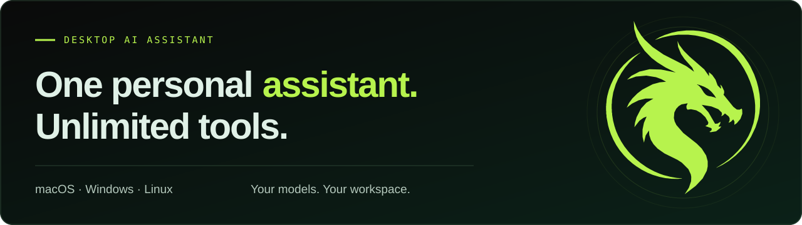

<p align="center">
  <a href="https://www.kucedr.com/">
    
  </a>
</p>

<p align="center">
  Your personal AI assistant for writing, research, coding, and creative work.<br />
  Bring your files, choose your models, and turn a conversation into action.
</p>

<p align="center">
  <a href="https://github.com/HaraldBregu/kucedr/releases"><strong>Download</strong></a> ·
  <a href="https://www.kucedr.com/">Website</a> ·
  <a href="docs/README.md">Documentation</a> ·
  <a href="CONTRIBUTING.md">Contributing</a> ·
  <a href="SECURITY.md">Security</a>
</p>

<p align="center">
  <strong>macOS · Windows · Linux</strong><br />
  Local profile · Your choice of AI providers · <a href="LICENSE">MIT license</a>
</p>

## Meet Kucedr

Kucedr is a desktop AI assistant that brings conversation, tools, and your personal context into
one workspace. Ask it to summarize a document, research a question, edit project files, or create
images, audio, and video. Type or speak, attach files, and follow the agent's tool activity as it
works through the task.

Choose providers and models separately for chat, voice, and media. Shape the assistant with
instructions, memory, and a searchable knowledge base; connect services through MCP; and schedule
recurring tasks and health checks while Kucedr is running. Extend your workspace with focused apps,
reusable skills, and compatible remote agents.

Conversations, settings, memory, and workspace files live in your local Kucedr profile. A Kucedr
account is optional for local use. Tasks that use external models or connected services send the
required inputs to those services; selected folders can also be backed up or synchronized remotely.
See [Control and Privacy](#control-and-privacy) for credential handling and data boundaries.

Start with the [application guide](docs/APPLICATION.md), or explore the full
[documentation index](docs/README.md).

## What Kucedr Can Do

- **Work with your computer** — read, create, and edit files; apply precise patches; and run commands or long-lived processes.
- **Understand more than text** — accept image and PDF attachments, transcribe speech, and read responses aloud.
- **Research and browse** — search the web, fetch pages, and automate browser interactions when a task requires them.
- **Create media** — generate images, videos, music, and sound effects with your selected providers and models.
- **Use your preferred AI providers** — configure your own API keys and select models separately for chat, speech, image, video, and audio.
- **Extend the agent** — import reusable skills, connect remote HTTP or local stdio MCP servers, and delegate independent work to subagents.
- **Automate routines** — create recurring schedules and periodic checklist-based health runs.
- **Remember useful context** — maintain durable memory, personalization files, conversation history, and a local working directory.
- **Search personal knowledge** — index selected folders with explicit embedding and remote-storage consent, then retrieve source excerpts from the local RAG index.
- **Manage local work** — browse and edit Markdown in the Workspace, and organize imported files in Library.
- **Chat from other apps** — connect Telegram to reach Kucedr away from the desktop app.

Kucedr runs on Windows, macOS, and Linux, with English and Italian interfaces and light, dark, and system themes.

## Control and Privacy

- Model, database, and search API keys are stored in plaintext in local provider settings.
- Storage secret keys require secure device storage. MCP secrets, channel tokens, and account
  sessions use encrypted device storage when available, with memory-only fallback for those secrets.
- Prompts, attachments, and tool data may be sent to the providers, MCP servers, websites, or messaging channels you configure. Backup and version sync upload selected folder data to configured storage.
- File writes, edits, patches, and command execution follow configured permissions and trusted
  locations. MCP approval is configured per server; permitted actions may run without a new prompt.
- Tool activity is streamed into the conversation so you can follow what the agent is doing.
- Read the [security policy](SECURITY.md) for the implemented protections and their limits.

## Technology

- Electron 44 and Node.js
- React 19, TypeScript, Tailwind CSS 4, and shadcn components
- Jest, Testing Library, and Playwright
- electron-vite and electron-builder

## Getting Started

### Download the desktop app

Choose a package for your operating system from [GitHub Releases](https://github.com/HaraldBregu/kucedr/releases).
After launch, configure a model provider and select an assistant model. You can continue local-only
without an account; provider usage may require your own credentials and incur charges.

### Run from source

Requirements: Node.js 22.19+ and npm 11.5.1+.

```bash
npm ci
npm run dev
```

The root install includes the Electron app, `@kucedr/sdk`, and `@kucedr/cli` through npm
workspaces and one lockfile. The manifest also declares a `website` workspace, but that
directory is absent in this checkout; website scripts require it to be supplied separately.

On first launch, follow the [Start Page Flow](docs/ui/START.md) to sign in or continue local-only,
save a model-provider API key, and select the provider and model for the assistant. Search,
database, speech, and media configuration are optional and can be completed later in Settings.
Configure an S3-compatible provider and select folders for backup in **Settings → Storage**.
Folder backup does not require account sign-in. Version history sync requires sign-in and a
configured backend; see [Cloud file synchronization](docs/STORAGE_SYNC.md).
See [Home UI](docs/ui/HOME.md) for the chat workspace's states and interactions.
See [Settings UI](docs/ui/SETTINGS.md) for configuration navigation and behavior.

If the normal development command cannot start on your Linux host, the following local-development
command disables Electron's sandbox. Do not use this override for production distribution:

```bash
npm run dev-linux
```

### Command-line interface

The TypeScript CLI lives in `packages/cli`. It launches the desktop app, installs validated Kucedr
plugins, and includes an interactive terminal interface:

```bash
npm run cli:build
npm link ./packages/cli

kucedr
kucedr install package-one
kucedr tui
```

The CLI validates and stores plugin packages, but the desktop runtime does not automatically
activate contributions from the CLI install directory. See [Plugins](docs/PLUGINS.md) for supported
runtime paths. Inside the TUI, enter `/install package-one`. See
[`packages/cli/README.md`](packages/cli/README.md) for the command and plugin-install contracts.

## Quality Checks

For documentation-only changes, check the touched Markdown with Prettier and verify relative links.
See [Contributing](CONTRIBUTING.md#documentation-changes) for the workflow.

For code changes, run the main local checks before submitting:

```bash
npm run quality:check
```

This runs dependency audits, TypeScript checks, ESLint, main-process tests, renderer tests, and package tests. Run the end-to-end suite separately:

```bash
npm run test:e2e
```

## Build and Package

```bash
npm run build                # Type-check and create a production build
npm run dist:win             # Windows x64 installer and portable executable
npm run dist:win:portable    # Windows x64 portable executable only
npm run dist:mac             # macOS package for x64 and arm64
npm run dist:mac:dmg         # macOS DMG for x64 and arm64
npm run dist:linux:appimage  # Linux AppImage
npm run dist:linux:portable  # Linux AppImage and tar.gz archive
```

### Portable releases

With Node.js 22 or newer, run `bash scripts/install.sh` on macOS or Linux, or from Git Bash on Windows.
It selects the latest published Kucedr release for the current OS and architecture, then places
the portable app in `%LOCALAPPDATA%\\Programs\\Kucedr`, `~/Applications`, or `~/.local/bin`,
respectively. Windows and Linux builds support x64; macOS builds support x64 and arm64.
If no matching Kucedr artifact has been published, the script reports that instead of installing
an older Friday release or an installer package.

On Windows, download `Kucedr-Portable-<version>-x64.exe` and run it directly. It temporarily
extracts its application files while Kucedr is running, but does not install shortcuts,
file associations, or uninstall records and does not require administrator access.

On Linux, download the AppImage, mark it executable, and launch it. If AppImage mounting or FUSE
is unavailable, extract the `.tar.gz` release and run `kucedr-desktop` from the extracted folder.
Neither option requires a package installation.

Kucedr settings, conversations, workspace files, and generated data remain under
`%USERPROFILE%\.kucedr` on Windows or `$HOME/.kucedr` on Linux. Electron runtime data remains in
`%APPDATA%\Kucedr` on Windows or `$XDG_CONFIG_HOME/Kucedr` on Linux, normally
`$HOME/.config/Kucedr`. Portable updates are manual: close Kucedr and replace the executable or
extracted application; the profile data remains in place.

Portable packaging does not bypass AppLocker, WDAC, Linux `noexec`, endpoint security, or network
policy. Protected command execution may require administrator or IT setup, and browser automation
requires an installed, permitted Google Chrome. Kucedr reports these limitations without preventing
chat and other supported features from running.

## Project Structure

- `src/main` contains the Electron main process, agent runtime, channels, model integrations, media services, transcription, IPC, and application services.
- `src/renderer/src` contains the React user interface.
- `src/preload` exposes the narrow bridge between the renderer and main process.
- `src/shared` contains cross-process types and API contracts.
- `src/main/terminal` contains the PTY lifecycle behind the typed terminal IPC API. See [Terminal IPC Architecture](docs/TERMINAL.md).
- `packages/cli` contains the publishable TypeScript command-line and terminal interface.
- `packages/sdk` contains typed embedded bridges and an HTTP client; this checkout does not start
  a matching standalone SDK HTTP server. See [Application Architecture](docs/ARCHITECTURE.md).
- `src/main/agent` contains sessions, tools, skills, memory, schedules, health runs, sandboxing, and permission policy.
- `src/main/models` contains provider-specific model integrations. See
  [Provider Reference](docs/PROVIDERS.md) for the built-in catalog and runtime support matrix.
- `src/main/cloud` and `src/main/storage` keep account and cloud behavior behind replaceable ports.
  See [Account and Cloud Architecture](docs/CLOUD.md).

## Security

Renderer windows use sandboxing, context isolation, disabled Node integration, and web security. Preload APIs expose narrow typed IPC methods, and agent writes, edits, patches, and command execution are subject to the permission policy.

See [SECURITY.md](SECURITY.md) for the security policy and vulnerability reporting process.

## Releases

The Electron app, SDK, and CLI are versioned independently. Checked-in automated release workflows
are currently disabled; follow the local release checks before publishing.
See [Development, Testing, and Deployment](docs/DEVELOPMENT.md) for local setup, test
commands, normal pushes, tag conventions, npm trusted publishing, desktop signing, and
recovery procedures.

## Contributing

See [CONTRIBUTING.md](CONTRIBUTING.md) for setup, workflow, and code standards. Behavioral guidelines for AI-assisted contributions are in [AGENTS.md](AGENTS.md).

## License

[MIT](LICENSE) © 2026 Harald Bregu
